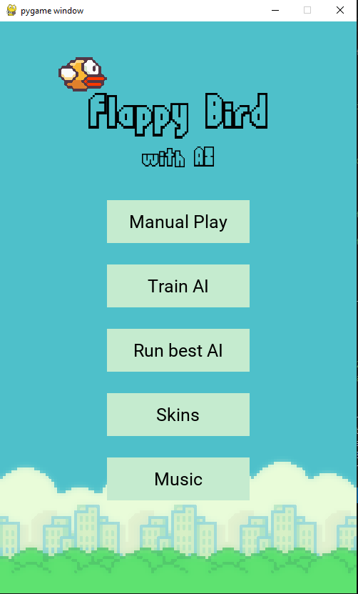

## Portfolio

---
### Association for Computing Machinery (ACM) Projects

[Flappy Bird with AI](https://github.com/JakeSchultz/FlappyBirdWithAI)

---
### CS3220 | Web And Internet Programming

[Box Office](/Lab3/BoxOffice.html)  
 Static webpage that lists some movies, their links on imdb and some info about the movies.  

---
[Zoom Link Organizer]()
 Dynamic web page that allows the user to enter course names and their zoom links to keep them organized 
---

### Category Name 2

- [Project 1 Title](http://example.com/)
- [Project 2 Title](http://example.com/)
- [Project 3 Title](http://example.com/)
- [Project 4 Title](http://example.com/)
- [Project 5 Title](http://example.com/)

---



---

Page template forked from <a href="https://github.com/evanca/quick-portfolio">evanca</a>

<!-- Remove above link if you don't want to attibute -->
