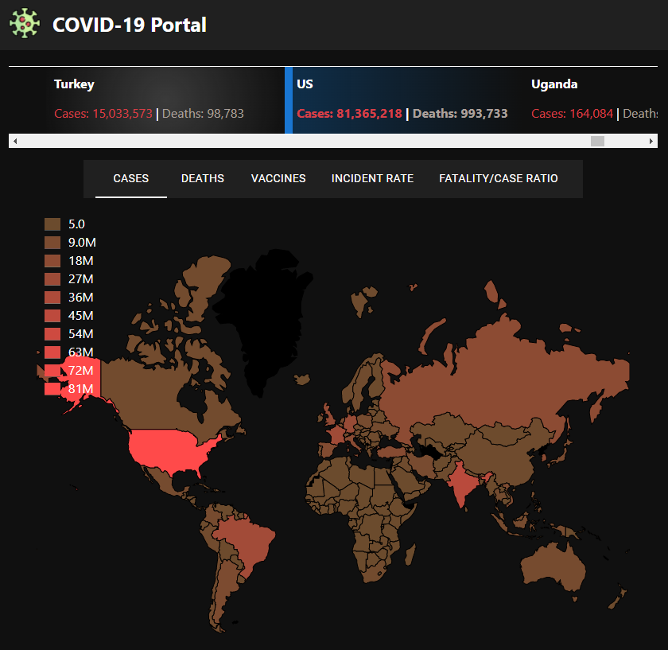
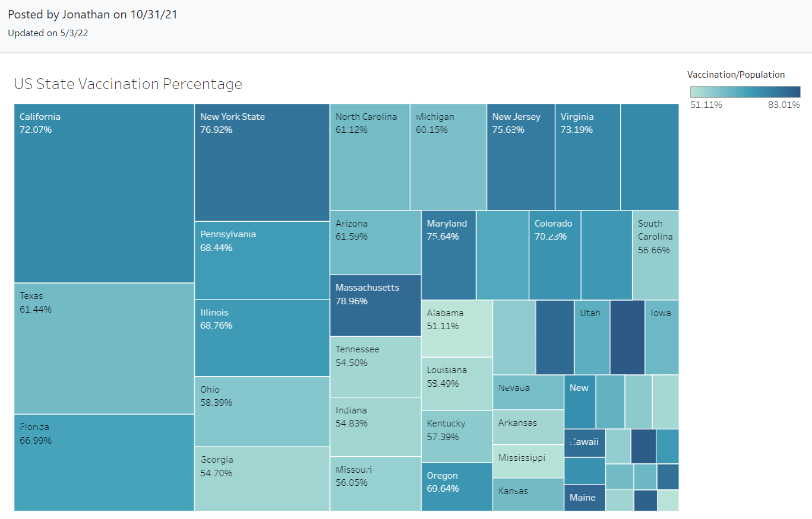

## Portfolio

---
### Association for Computing Machinery (ACM) Projects

[Flappy Bird with AI](https://github.com/JakeSchultz/FlappyBirdWithAI)

---
### CS3220 | Web And Internet Programming

[Box Office](/Lab3/BoxOffice.html)  
 Static web page that lists some movies, their links on imdb and some info about the movies.  

---
[Zoom Link Organizer](https://github.com/JakeSchultz/ZoomLinkOrganizer)
 Dynamic web page that allows the user to enter course names and their zoom links to keep them organized 

---

### CS4555 | Introduction to 3D Computer Game Programming

[One More Day](https://simmer.io/@EagleGameStudio/onemoreday)  

 First Person Bullethell style shooter developed in Unity 

---

### Senior Project | Comorbidity and its Impact on  Patients with COVID-19 | Vodafone Group
[Project Page on School Website](https://csns.cysun.org/department/cs/project/view?id=7873473)  

[Vodafone Covid Portal](https://stay-fcsd.github.io/vodafone-covid-portal/) 

 Worked with Vodafone and a team of fellow students to create a web based portal for visualizing Covid 19 data. This portal focuses on Incident Rates, Death Rates, and Vaccination Rates. We levereged JavaScript, the D3.js library to create the visualizations. I used github actions to automate and optimize the data collection process.  
[Tableau Covid Dashboard](https://168jonathankan.github.io/COVID-19-Dashboard/index.html) 

 There is a second site associated with this one that utilized Tableau and python to generate visualizations similar to the previous portal but it contains information on different variants. There is also some data on comorbities compared for the US.  


---
- [Project Title](http://project.com) 
---


---

Page template forked from <a href="https://github.com/evanca/quick-portfolio">evanca</a>

<!-- Remove above link if you don't want to attibute -->
